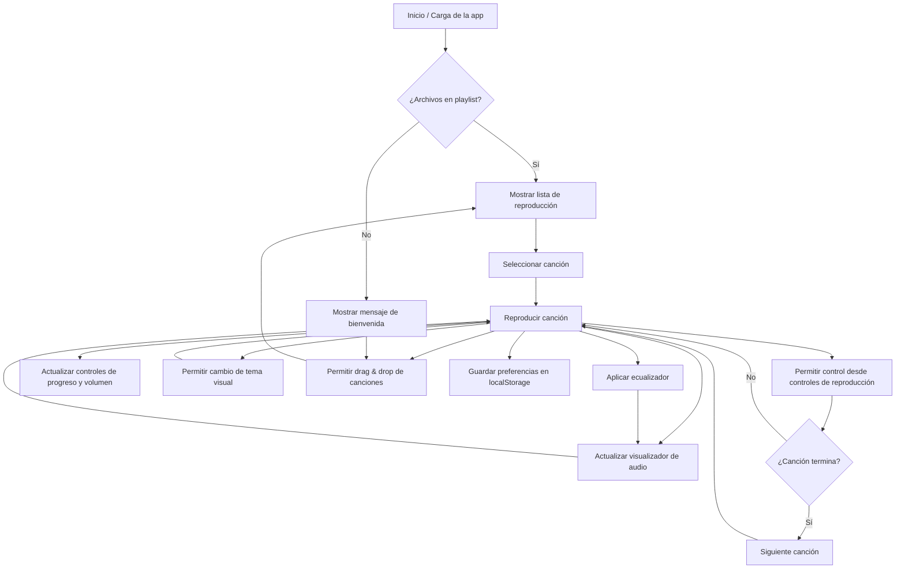

# AmpWave Music Player

🎵 **AmpWave Music Player**

¡La nueva forma de disfrutar tu música local en cualquier dispositivo! Un reproductor moderno, ligero y multiplataforma, diseñado para ofrecerte la mejor experiencia musical, estés donde estés.

---

## 🚀 ¿Qué es AmpWave?
AmpWave Music Player es un reproductor de música web progresivo (PWA) y de escritorio, pensado para quienes buscan simplicidad, velocidad y personalización. Sin ataduras a marcas del pasado, AmpWave es una app con identidad propia, creada para la nueva generación de amantes de la música.

---

## 🌟 Misión
**Hacer que escuchar tu música local sea tan fácil, bonito y universal como debería ser.**

## 👁️ Visión
Ser el reproductor de música personal más accesible, personalizable y multiplataforma del mundo.

---

## 🎨 Branding
- **Nombre:** AmpWave Music Player
- **Eslogan:** _"Tu música, tu onda, en cualquier parte."_
- **Colores:** Verde neón (#00ff00), negro profundo (#222), acentos personalizables según tema.
- **Icono:** .png)

---

## ✨ Características principales
- **Instalable en cualquier dispositivo** (PWA: móvil, tablet, escritorio)
- **App de escritorio** (Windows, Mac, Linux) con Electron
- **Ecualizador de 10 bandas** visual y funcional
- **Selector de temas visuales** (Original Amp, Moderno, Retro 90s, Neon Cyber, Minimalista, Dark Mode)
- **Visualizador de audio** en tiempo real
- **Lista de reproducción con drag & drop**
- **Control de volumen y progreso**
- **Persistencia de preferencias** (tema, playlist)
- **Responsive y accesible**
- **Sin publicidad, sin rastreadores, sin cuentas**

---

## 📱 Instalación y uso
### Como app web (PWA)
1. Abre [https://ampwave-music-player.vercel.app/](https://ampwave-music-player.vercel.app/) en tu navegador.
2. Haz clic en “Instalar app” o “Agregar a pantalla de inicio”.
3. ¡Disfruta de tu música local en cualquier dispositivo!

### Repositorio
- [GitHub: RzenDev/ampwave-music-player](https://github.com/RzenDev/ampwave-music-player)

---

## 📖 Historia del nombre: ¿Por qué “AmpWave Music Player”?

En la era de los reproductores clásicos, la nostalgia y la innovación se cruzaron en un punto: la pasión por la música y la tecnología. “AmpWave” nace de la fusión de dos conceptos clave:

- **Amp**: Un guiño a los amplificadores de audio y a la legendaria estética Winamp, pero con una visión moderna y sin ataduras al pasado.
- **Wave**: Representa la universalidad de la música como onda, vibración y energía, y también la tecnología de las formas de onda digitales (audio digital, visualizadores, etc).

Así, “AmpWave Music Player” es más que un reproductor: es una ola de energía musical, un homenaje a la libertad de escuchar tu música, con el poder de la personalización y la tecnología actual. Su nombre refleja la misión de unir lo mejor del pasado y el presente, en una experiencia fresca, visual y universal.

---

## 🗺️ Diagrama de flujo de la app

---

## 🛠️ Tecnologías utilizadas
- **HTML5, CSS3, JavaScript ES6+**
- **Web Audio API** (ecualizador y visualizador)
- **Electron** (app de escritorio)
- **PWA** (manifest, service worker)
- **Font Awesome** (iconos)

---

## 🗺️ Roadmap (en desarrollo)
- [x] Ecualizador de 10 bandas
- [x] Temas visuales personalizables
- [x] Visualizador de audio
- [x] PWA instalable
- [x] App de escritorio multiplataforma
- [ ] Soporte para listas de reproducción guardadas en la nube
- [ ] Integración con letras de canciones
- [ ] Más temas visuales y personalización
- [ ] Mejoras de accesibilidad y usabilidad
- [ ] Traducciones a más idiomas

---

## 🤝 Contribuye
AmpWave Music Player es un proyecto abierto y en evolución. ¿Tienes ideas, sugerencias o quieres colaborar? ¡Eres bienvenido!

---

## 📝 Licencia
MIT. Usa, modifica y comparte libremente.

---

## © 2025 AmpWave Music Player

---

**¡Disfruta tu música con estilo, libertad y sin límites!** 